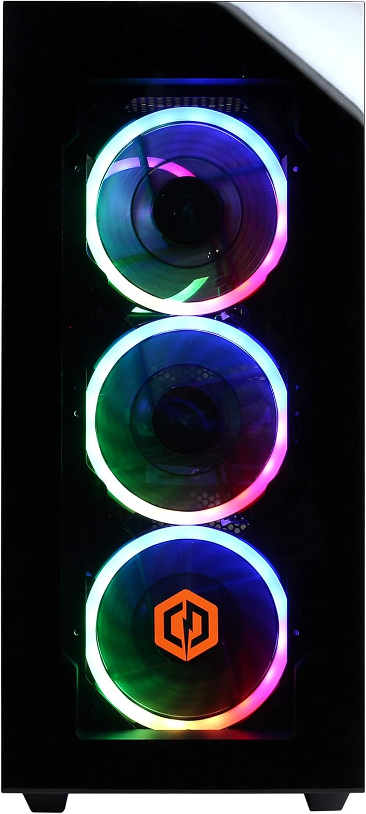

# Tobi's NixOS configurations

This is where I maintain my [NixOS](https://nixos.org/) configurations for my file and compute servers.

These humble machines live in my garage.

- [St. Eligius](https://www.newadvent.org/cathen/05386a.htm) is the patron saint of goldsmiths, blacksmiths, and all metal workers. Because of this, I named my main GPU server after him.
  - 
- [St. Isidore of Seville](https://www.newadvent.org/cathen/05386a.htm) is the patron saint of the internet. I chose this because this server is optimized for data storage.
  - 

