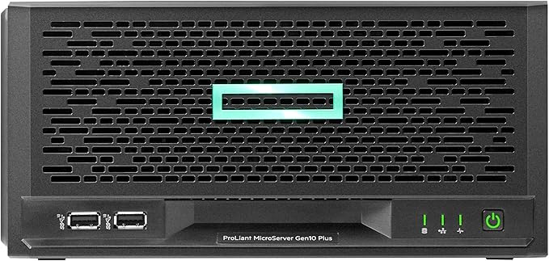
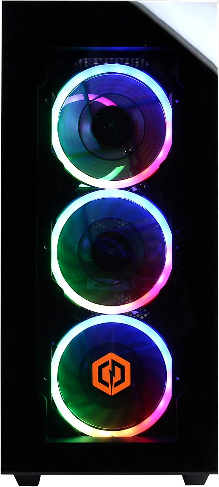

# Tobi's NixOS configurations

This is where I maintain my [NixOS](https://nixos.org/) configurations for my file and compute servers.

These humble machines live in my garage. They are named after the saints.

## [St. Isidore of Seville](https://www.newadvent.org/cathen/05386a.htm) is the patron saint of the internet. I chose this because this server is optimized for data storage.

### `isidore` is an HPE MicroServer Gen10 Plus, Intel Xeon E-2224 3.4GHz

## [St. Eligius](https://www.newadvent.org/cathen/05386a.htm) is the patron saint of goldsmiths, blacksmiths, and all metal workers. Because of this, I named my main GPU server after him.

### `eligius` is a CyberpowerPC PC, Intel Core i7-9700K 3.6GHz, NVIDIA GeForce RTX 2070

